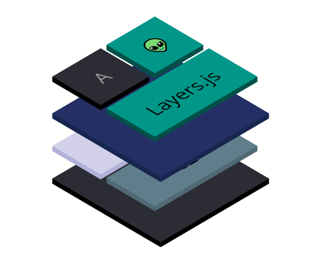

# Layers.js
Layers.js



## Demo
[LIVE DEMO](https://hlhielkema.github.io/layers.js/)

## How to use

### Initialize Layers.js

``` js
var layersJs = new LayersJs('.layers-container');
```

### Add an ```` layer
``` js
layersJs.addImageLayer('a', 'img/layer_a.svg');
```

### Create a simple `<div>` layer

``` js
layersJs.addDivLayers('b', {
    top: '64px',
    shape: {
        decorate: shape => shape.innerText = 'B',
        background: '#242f65',
        borderBackground: '#17264e'
    }
});
```

### Create a more advanced `<div>` layer

``` js
layersJs.addDivLayers('a', {    
    shape: [
        {
            class: 'quarter',
            decorate: shape => shape.innerText = 'A', 
            color: '#999',
            background: '#2b2c34',
            borderBackground: '#000' 
        },
        {
            class: 'quarter',
            decorate: shape => shape.innerHTML = '👽',            
            background: '#009688',
            borderBackground: '#035049' 
        },
        {
            class: 'half',
            decorate: shape => shape.innerText = 'Layers.js',            
            background: '#009688',
            borderBackground: '#035049' 
        }
    ]
});
```

### Configure state groups

``` js
layersJs.updateStateGroups({
    a: {
        a: true,
        b: true,
        c: true,
        d: true,
    },
    b: {
        a: false,
        b: true,
        c: true,
        d: true,
    },
    c: {
        a: false,
        b: false,
        c: true,
        d: true,
    },
    d: {
        a: false,
        b: false,
        c: false,
        d: true,
    },
    e: {
        a: true,
        b: false,
        c: true,
        d: true,
    },
});
```

### Switch visible states

``` js
layersJs.applyStateGroup('c');   
```

### Set animation style

``` js
layersJs.updateAnimationMode('fade-right');
```

**Available styles:**

- `fade-down`
- `fade-right`
- `fade-up`
- `fade-left`
- `fade`
- `none`